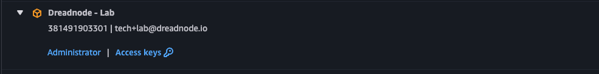
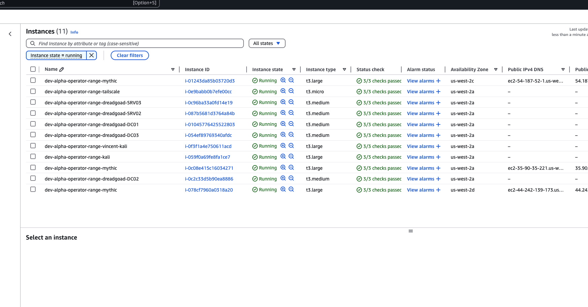
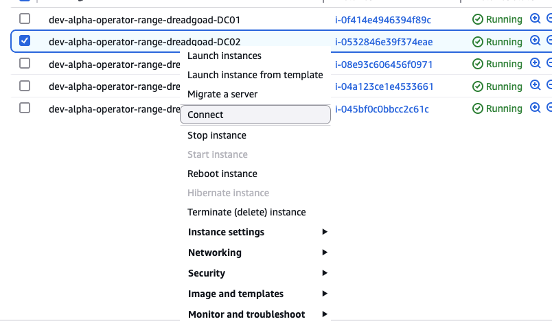
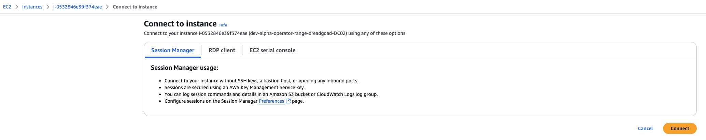

<div align="center">
  <h1></h1>
  <br>
</div>

## 🚀 Overview

**DreadGOAD** is a heavily refactored version of
[GOAD (Game of Active Directory)](https://github.com/Orange-Cyberdefense/GOAD),
specifically tailored for efficient Active Directory (AD) pentesting
environments. It simplifies infrastructure provisioning using Terraform and
Ansible under the [DreadOps Project](https://github.com/dreadnode/DreadOps),
specifically within the [alpha-operator-range](https://github.com/dreadnode/DreadOps/tree/main/dread-infra/alpha-operator-range)
deployment.

📖 **Legacy Documentation:** For historical reference, see [Original GOAD Documentation](./docs/original-readme.md).

---

## 📋 Vulnerable Lab

Currently, DreadGOAD provides the following windows-based lab environment:

- [GOAD](https://orange-cyberdefense.github.io/GOAD/labs/GOAD/) : 5 VMs, 2
forests, 3 domains
<div align="center">

</div>

**Please note:**

- All of the other original GOAD labs are deprecated and unsupported.
- The IP addresses found in the above schema diagram are not accurate for the
  DreadGOAD environment. Please refer to the
  [AWS console](#-access-via-the-aws-console) for the correct IP addresses.

---

## ⚙️ Getting Started

DreadGOAD provisioning and management utilize Ansible and AWS Systems Manager
(SSM), orchestrated via [Task](https://taskfile.dev). Follow these steps to set
up and deploy the lab environment:

### ✅ Prerequisites

Before provisioning, ensure the following are installed and configured:

- [AWS CLI](https://aws.amazon.com/cli/)
- [jq](https://stedolan.github.io/jq/)
- [Task](https://taskfile.dev) (`brew install go-task/tap/go-task`)

### 🚧 Provisioning the Environment

1. **List available Ansible playbooks:**

   ```bash
   task list-plays
   ```

1. **Update the Ansible inventory with AWS instance IDs:**

   ```bash
   task update-inventory ENV=dev
   ```

1. **Provision the AD environment:**

   ```bash
   task provision ENV=dev
   ```

---

### 🛠️ Useful Task Examples

- **Example for provisioning using specific playbooks:**

  ```bash
  task provision PLAYS="build.yml ad-servers.yml" ENV=staging
  ```

- **Inspect files related to specific playbooks:**

  ```bash
  task get-files PLAYBOOK=security
  ```

---

## 🔐 Accessing Provisioned DreadGOAD Systems

You can access the provisioned DreadGOAD systems through several methods
detailed below:

### 📌 Access via the AWS Console

**Step 1:** Navigate to the [AWS account portal](https://dreadnode.awsapps.com/start/#/?tab=accounts).

**Step 2:** Click the **Administrator** link under the **Dreadnode - Lab**
account. If you do not have access, please contact Jayson or Nick.



**Step 3:** Click the **EC2** link on the left-hand side and navigate to the
running instances.



> **Note:** Ensure you are viewing the correct region:
>
> - **dev**: `us-west-2`
> - **staging**: `us-west-1`

**Step 4:** Right-click the instance you want to access and select **Connect**.



**Step 5:** Under the **Session Manager** tab, click **Connect**.



You should now have a PowerShell terminal open in your browser.

---

### 📌 Access via AWS CLI

**Step 1:** [Install the AWS CLI](https://docs.aws.amazon.com/cli/latest/userguide/install-cliv2.html).

**Step 2:** Create a new profile in your `~/.aws/config`:

```bash
################################################################################
############################### Dreadnode ######################################
[sso-session organization-sso]
cli_pager=
sso_start_url = https://dreadnode.awsapps.com/start/#
sso_region = us-east-1
sso_registration_scopes = sso:account:access

[profile lab]
cli_pager=
sso_session = organization-sso
sso_account_id = 381491903301
sso_role_name = Administrator
region = us-west-2
output = json
```

**Step 3:** Log in via the AWS CLI:

```bash
export AWS_PROFILE=lab
export AWS_SDK_LOAD_CONFIG=1
export AWS_DEFAULT_REGION=us-west-2
aws sso login --profile lab --region us-west-2
```

**Step 4:** Install the Session Manager plugin:

```bash
brew install cask session-manager-plugin --no-quarantine
```

**Step 5:** Start a session with:

```bash
aws ssm start-session --target $INSTANCE_ID
```

> Replace `$INSTANCE_ID` with the ID of your desired instance.

---

### 📌 Access via RDP

**Step 1:** Start a port forwarding session:

```bash
aws ssm start-session --target $INSTANCE_ID --document-name AWS-StartPortForwardingSession --parameters "portNumber=3389,localPortNumber=13390"
```

> Replace `$INSTANCE_ID` with the ID of your desired instance. You can use any
> local port number.

**Step 2:** Open **Remote Desktop Connection** and connect to `localhost:13390`.

Log in using either:

- The `Administrator` account with the password located in the
  environment-specific DreadOPS SOPS file, for example:

> - **Dev (us-west-2):** [https://github.com/dreadnode/DreadOps/tree/main/dread-infra/alpha-operator-range/dev/us-west-2/secrets](https://github.com/dreadnode/DreadOps/tree/main/dread-infra/alpha-operator-range/dev/us-west-2/secrets)
> - **Staging (us-west-1):** [https://github.com/dreadnode/DreadOps/tree/main/dread-infra/alpha-operator-range/staging/us-west-1/secrets](https://github.com/dreadnode/DreadOps/tree/main/dread-infra/alpha-operator-range/staging/us-west-1/secrets)

or:

- Any domain user/password combination listed in the corresponding
  environment-specific configuration file, such as:

> - `ad/GOAD/data/dev-config.json`
> - `ad/GOAD/data/staging-config.json`

---

## 🔗 Additional Resources

- [Taskfile Reference](./docs/taskfile.md)
- [Troubleshooting Guide](./docs/troubleshooting.md)
- [Synchronizing DreadGOAD with Upstream](./docs/sync-upstream.md)

---

## 🚨 Important Notes

- **AWS CLI configuration** (`aws configure`) is required.
- Regularly run `update-inventory` to maintain accurate host data.
- Provisioning tasks handle retries and error handling.

---

## 🛡️ Disclaimer

This lab environment is intentionally vulnerable and is strictly intended for
security research. **Do not deploy this environment publicly or use it as a
template for production environments.**
